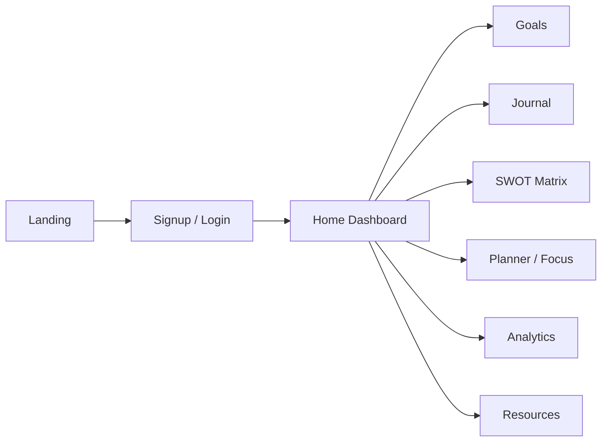

# SWOT — Strategic Life Tracking Dashboard

[](#)
[](#)
[](#)

SWOT is a clean, multi-page productivity app that helps users plan, reflect, and grow using the **SWOT framework** (Strengths, Weaknesses, Opportunities, Threats).

---

## 🔎 Quick Navigation

- [Overview](#-overview)
- [Core Features](#-core-features)
- [Screens & Modules](#-screens--modules)
- [Tech Stack](#-tech-stack)
- [Getting Started](#-getting-started)
- [Project Structure](#-project-structure)
- [Product Flow](#-product-flow)
- [Roadmap](#-roadmap)

---

## ✨ Overview

This project combines strategic planning with day-to-day execution:
- Track meaningful goals
- Capture journal insights
- Build and maintain a personal SWOT matrix
- Monitor progress with dashboard analytics and focus tools

It is built as a static frontend app with browser storage and Supabase-based authentication.

---

## 🚀 Core Features

| Feature | What it does |
|---|---|
| Authentication | Sign up, log in, and session protection using Supabase |
| Dashboard | Snapshot of tasks, sessions, streaks, and momentum |
| Goals | Add, update, complete, and manage strategic goals |
| Journal | Record entries with title, body, and mood |
| SWOT Matrix | Create and manage items across S/W/O/T categories |
| Focus Tools | Session timer + daily focus support |
| Analytics | Visual insights for growth and consistency |
| Resources | Curated learning and development area |

---

## 🧭 Screens & Modules

<details>
  <summary><strong>Click to expand screen map</strong></summary>

| Page | Purpose |
|---|---|
| `index.html` | Landing page and product entry |
| `signup.html` / `login.html` | User onboarding and authentication |
| `home.html` | Main dashboard experience |
| `goals.html` | Goal planning and tracking |
| `journal.html` | Reflection and journaling |
| `my-swot.html` | SWOT matrix management |
| `planner.html` | Daily plan and focus alignment |
| `analytics.html` | Progress and pattern insights |
| `resources.html` | Learning resources |
| `settings.html` | Account and personalization settings |

</details>

---

## 🛠 Tech Stack

- **Frontend:** HTML5, CSS3, Vanilla JavaScript (ES Modules)
- **Auth & Session:** Supabase JavaScript client
- **Persistence:** Browser LocalStorage (goals, sessions, journal, matrix, profile)
- **Charts/Visuals:** Native/CSS chart rendering with lightweight in-page scripts

---

## ⚡ Getting Started

### 1) Clone the repository

```bash
git clone https://github.com/TheAmazingPushkar/SWOT.git
cd SWOT
```

### 2) Run locally

Because this is a static web app, open `index.html` in a browser, or run any static server:

```bash
python -m http.server 8000
```

Then visit: `http://localhost:8000`

### 3) Configure authentication (if needed)

Supabase credentials are currently referenced in `main.js`. For production, prefer environment-based injection and key management best practices.

---

## 📁 Project Structure

```text
SWOT/
├── index.html
├── login.html
├── signup.html
├── home.html
├── goals.html
├── journal.html
├── my-swot.html
├── planner.html
├── focus.html
├── analytics.html
├── resources.html
├── settings.html
├── main.js
├── home.js
├── *.css
└── README.md
```

---

## 🔄 Product Flow



---

## 🧩 Roadmap

- [ ] Add backend persistence for goals, journal, and SWOT matrix
- [ ] Improve role-based settings and profile controls
- [ ] Add richer charts and historical trend analysis
- [ ] Introduce export/import improvements and sharing
- [ ] Add automated tests and CI checks

---

## 📄 License

This project is distributed under the terms of the [LICENSE](./LICENSE).